# Demo: Análise de Dados de Manutenção Aeronáutica em Tempo Real no GCP

Este projeto demonstra um pipeline de dados em tempo real no Google Cloud Platform (GCP) para análise de dados sintéticos de manutenção aeronáutica.

**Objetivo:** Ingerir dados de um banco transacional (Cloud SQL PostgreSQL), replicá-los continuamente para um data warehouse (BigQuery) usando o Datastream e visualizá-los em tempo real em um dashboard (Looker/Looker Studio).

## Arquitetura

O diagrama abaixo ilustra o fluxo de dados e os componentes da solução:

```mermaid
graph LR
    subgraph "Geração de Dados"
        A[Usuário/Trigger] --> B(Cloud Run: Python/Flask App);
        B -- Insere dados --> C[Cloud SQL PostgreSQL];
    end

    subgraph "Replicação Real-time (CDC)"
        C -- Leitura (Logical Replication) --> D(Datastream);
        D -- Escreve dados --> E[BigQuery];
    end

    subgraph "Visualização & Análise"
        E -- Consulta dados --> F(Looker / Looker Studio);
        F -- Exibe Dashboard --> G[Usuário Final];
    end

    B -- Conexão segura via Cloud SQL Connector --> C;

    style C fill:#DB4437,stroke:#333,stroke-width:2px,color:#fff;
    style E fill:#4285F4,stroke:#333,stroke-width:2px,color:#fff;
    style D fill:#F4B400,stroke:#333,stroke-width:2px,color:#333;
    style B fill:#0F9D58,stroke:#333,stroke-width:2px,color:#fff;
    style F fill:#AB47BC,stroke:#333,stroke-width:2px,color:#fff;
```



**Componentes Principais:**

1.  **Cloud SQL (PostgreSQL):** Banco de dados relacional gerenciado que atua como a fonte de dados transacionais. Armazena os eventos de manutenção.
2.  **Aplicação Python (Flask):** Rodando no Cloud Run, esta aplicação fornece um endpoint HTTP para gerar dados sintéticos (usando a biblioteca Faker) e inseri-los no banco Cloud SQL PostgreSQL.
3.  **Datastream:** Serviço de Change Data Capture (CDC) e replicação de dados. Configurado para ler as alterações (inserts, updates, deletes) do PostgreSQL e escrevê-las no BigQuery em tempo real ou com baixa latência. Utiliza conectividade privada para segurança.
4.  **BigQuery:** Data warehouse serverless, altamente escalável, que armazena os dados replicados para análise.
5.  **Looker / Looker Studio:** Ferramenta de Business Intelligence e visualização de dados. Conecta-se ao BigQuery para criar dashboards que mostram os dados de manutenção chegando quase em tempo real.
6.  **Terraform:** Ferramenta de Infraestrutura como Código (IaC) usada para provisionar e gerenciar todos os recursos GCP necessários (VPC, Cloud SQL, BigQuery, Datastream, etc.).

## Pré-requisitos

*   Conta GCP com um projeto criado.
*   Permissões para habilitar APIs e criar os recursos listados acima no projeto GCP.
*   [Google Cloud SDK (`gcloud`)](https://cloud.google.com/sdk/docs/install) instalado e configurado.
*   [Terraform](https://developer.hashicorp.com/terraform/downloads) instalado.
*   [Docker](https://docs.docker.com/engine/install/) instalado.
*   (Opcional) Acesso a uma instância do Looker ou usar o [Looker Studio](https://lookerstudio.google.com/).

## Configuração e Execução

1.  **Clonar o Repositório:**
    ```bash
    git clone <url-do-seu-repositorio>
    cd <diretorio-do-repositorio>
    ```

2.  **Configurar Autenticação GCP:**
    ```bash
    gcloud auth login
    gcloud config set project SEU_PROJECT_ID
    gcloud auth application-default login
    ```
    Certifique-se de que as APIs necessárias (`compute.googleapis.com`, `sqladmin.googleapis.com`, `servicenetworking.googleapis.com`, `bigquery.googleapis.com`, `datastream.googleapis.com`, `run.googleapis.com`, `artifactregistry.googleapis.com`, `cloudbuild.googleapis.com`) estejam habilitadas no seu projeto ou permita que o Terraform as habilite.

3.  **Construir e Enviar a Imagem Docker:**
    *   Navegue até o diretório `data_generator`: `cd data_generator`
    *   Construa a imagem (substitua `SEU_PROJECT_ID`):
        ```bash
        docker build -t gcr.io/SEU_PROJECT_ID/aero-data-generator:latest .
        ```
    *   Configure o Docker para autenticar com o Google Container Registry (ou Artifact Registry):
        ```bash
        gcloud auth configure-docker
        ```
        (Pode ser necessário especificar a região se estiver usando o Artifact Registry, ex: `gcloud auth configure-docker us-central1-docker.pkg.dev`)
    *   Envie a imagem:
        ```bash
        docker push gcr.io/SEU_PROJECT_ID/aero-data-generator:latest
        ```
        *(Nota: Crie um repositório no GCR/Artifact Registry se ainda não tiver um)*
    *   Volte para o diretório raiz: `cd ..`

4.  **Configurar Variáveis do Terraform:**
    *   Navegue até o diretório `terraform`: `cd terraform`
    *   Crie um arquivo `terraform.tfvars` com o seguinte conteúdo (ajuste os valores):
        ```terraform
        project_id             = "SEU_PROJECT_ID"
        region                 = "us-central1" # Ou sua região preferida
        zone                   = "us-central1-a" # Ou sua zona preferida
        db_password            = "SUA_SENHA_SEGURA_PARA_O_BANCO" # Use uma senha forte
        cloud_run_image_name = "gcr.io/SEU_PROJECT_ID/aero-data-generator:latest" # Imagem enviada no passo anterior
        # Outras variáveis podem ser mantidas com os defaults ou ajustadas se necessário
        ```
    *   **IMPORTANTE:** Nunca comite o arquivo `terraform.tfvars` com senhas no controle de versão. Adicione-o ao seu `.gitignore`.

5.  **Aplicar a Infraestrutura com Terraform:**
    ```bash
    terraform init
    terraform plan -var-file=terraform.tfvars
    terraform apply -var-file=terraform.tfvars
    ```
    Confirme a aplicação digitando `yes` quando solicitado. Anote o output `postgres_instance_connection_name`.

6.  **Implantar o Serviço Cloud Run:**
    *   Use o comando `gcloud run deploy` para implantar a imagem. Você precisará fornecer as variáveis de ambiente e configurar a conexão VPC.
    *   Obtenha o `INSTANCE_CONNECTION_NAME` do output do Terraform.
    *   Obtenha o nome da rede VPC criada pelo Terraform (geralmente `private-network`).
    *   **Exemplo de comando `gcloud` (ajuste conforme necessário):**
        ```bash
        gcloud run deploy data-generator-service \
          --image gcr.io/SEU_PROJECT_ID/aero-data-generator:latest \
          --platform managed \
          --region us-central1 \
          --allow-unauthenticated \ # Para testes fáceis; use IAM para produção
          --set-env-vars "DB_USER=maint_user" \
          --set-env-vars "DB_NAME=aeronautical_maintenance" \
          --set-env-vars "INSTANCE_CONNECTION_NAME=SEU_PROJECT_ID:us-central1:aero-maint-postgres" \ # Use o output do TF
          --set-secrets="DB_PASS=aero-db-password:latest" \ # Assumindo um secret chamado 'aero-db-password'
          --vpc-connector default \ # Ou o nome do conector, se criado separadamente
          --vpc-egress=all-traffic \
          --network=private-network # Nome da rede criada pelo TF
        ```
    *   **Nota sobre Senha:** É altamente recomendável usar o Secret Manager para a senha do banco (`DB_PASS`) em vez de passá-la diretamente como variável de ambiente. Crie um secret e conceda permissão à conta de serviço do Cloud Run para acessá-lo.
    *   **Nota sobre VPC Connector:** A configuração do Terraform já cria a rede VPC. Pode ser necessário criar um Serverless VPC Access connector manualmente ou via Terraform para conectar o Cloud Run à VPC. O exemplo acima assume um conector chamado `default` ou que a rede/sub-rede está configurada adequadamente para acesso direto. Consulte a documentação do Cloud Run para detalhes sobre conexão com Cloud SQL via IP privado.

7.  **Gerar Dados Iniciais:**
    *   Após a implantação do Cloud Run, você receberá uma URL para o serviço.
    *   Acesse a URL `/generate` no seu navegador ou use `curl` para acionar a geração de dados. Adicione `?n=X` para gerar X registros (padrão 10).
    *   Exemplo: `curl -X POST https://seu-servico-cloud-run-url.a.run.app/generate?n=50`

8.  **Verificar Datastream e BigQuery:**
    *   Acesse o console do Datastream no GCP e verifique o status do stream criado (`pg-to-bq-stream`). Ele deve estar no estado "Running".
    *   Acesse o BigQuery Studio, navegue até o dataset `aeronautical_data` (ou o nome definido) e verifique se a tabela `public_maintenance_events` (ou o nome exato criado pelo Datastream) foi criada e está sendo populada com dados. Pode levar alguns minutos para a replicação inicial começar.

9.  **Configurar Looker / Looker Studio:**
    *   **Conexão:** Crie uma nova fonte de dados/conexão do tipo BigQuery no Looker/Looker Studio, apontando para o seu `SEU_PROJECT_ID`. Nomeie a conexão como `gcp_bigquery_connection` (ou o nome que você definiu no arquivo `.model.lkml`).
    *   **Projeto LookML (Looker):** Crie um novo projeto LookML, conecte-o a este repositório Git (ou copie os arquivos `.lkml` para ele).
    *   **Fonte de Dados (Looker Studio):** Crie uma nova fonte de dados baseada na conexão BigQuery e selecione a tabela `public_maintenance_events` dentro do dataset `aeronautical_data_`.
    *   **Ajuste o Nome da Tabela:** **Edite o arquivo `looker/maintenance_events.view.lkml`** e corrija o valor de `sql_table_name` para o nome exato da tabela no BigQuery (ex: `\`SEU_PROJECT_ID.aeronautical_data_public_maintenance_events\``).
    *   **Criação do Dashboard:** Use o Explore "Eventos de Manutenção" (Looker) ou a fonte de dados criada (Looker Studio) para construir um dashboard. Crie gráficos (ex: contagem de eventos por tipo, eventos ao longo do tempo) e configure a atualização automática dos dados (se disponível) para visualizar a chegada de novos dados.

10. **Testar o Tempo Real:**
    *   Com o dashboard aberto, acione novamente o endpoint `/generate` do Cloud Run.
    *   Observe os dados sendo atualizados no dashboard do Looker/Looker Studio após alguns instantes (a latência dependerá das configurações do Datastream e do Looker/Looker Studio).

## Limpeza

Para evitar custos contínuos, destrua os recursos criados:

1.  **Limpeza Pré-Destroy (IMPORTANTE):**
    Antes de destruir a infraestrutura do Terraform, é **essencial** remover manualmente os artefatos de replicação lógica (slot e publicação) do PostgreSQL que foram criados para o Datastream. Caso contrário, o `terraform destroy` pode falhar ao tentar excluir a instância do Cloud SQL.

    *   **Pré-requisitos:** `terraform`, `gcloud` (autenticado), `cloud-sql-proxy`, `psql` instalados.
    *   **Execute o Script de Limpeza:** Navegue até o diretório `terraform` e execute o script fornecendo a senha do usuário administrador do banco (definido em `var.admin_db_user`):
        ```bash
        cd terraform
        chmod +x scripts/cleanup_replication.sh
        PGPASSWORD="SUA_SENHA_ADMIN_DB" ./scripts/cleanup_replication.sh
        ```
        Substitua `SUA_SENHA_ADMIN_DB` pela senha correta. Verifique o output do script para garantir que a limpeza foi bem-sucedida.

2.  **Destruir Infraestrutura Terraform:**
    Após a execução bem-sucedida do script de limpeza, destrua os recursos:
    ```bash
    cd terraform
    terraform destroy -var-file=terraform.tfvars
    ```
    Confirme a destruição digitando `yes`.

3.  **Remover Serviço Cloud Run:**
    ```bash
    gcloud run services delete data-generator-service --region us-central1
    ```

4.  **Remover Imagem Docker:**
    ```bash
    gcloud container images delete gcr.io/SEU_PROJECT_ID/aero-data-generator:latest --force-delete-tags
    ```
    (Ajuste o comando se estiver usando Artifact Registry)

5. **Remover Secrets (se criados):**
    ```bash
    gcloud secrets delete aero-db-password
    gcloud secrets versions destroy latest --secret="aero-db-password"
    ```

6. **(Opcional) Remover Conector VPC Access (se criado manualmente).**
7. **(Opcional) Remover Repositório GCR/Artifact Registry (se criado).** 